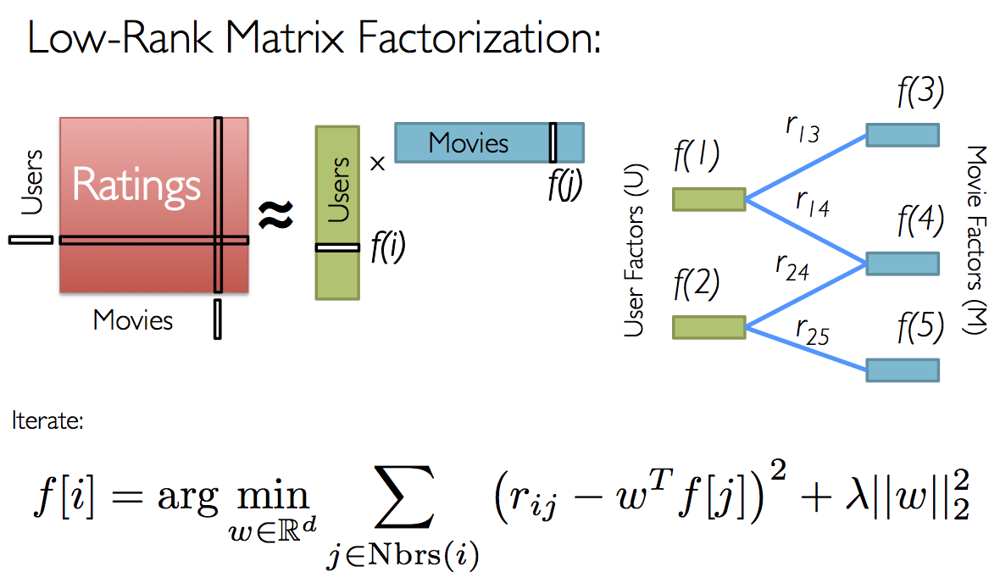

Task | Completed
------------------|----------------------------------------
Implementing UBCF      | **Percent**: 100
Implementing IBCF      | **Percent**: 100
Implementing metrics rmse     | **Percent**: 100
Implementing metrics ndcg     | **Percent**: 100
Using model to build system    | **Percent**: 100
Consideration of model params    | **Percent**: 100

# Lab 01:  Building Recommendation Systems

## K-Nearest Neighbors Recommendation

### UBCF: 

Implemmentation of UBCF algorithm: 100%

According to the slide and theory taught in class, there are 4 step to compute UBCF:

1.  Calculating the average rating of all users, using function **calc_average_rating**..
2.  Calculating the similarity score of each user to other user, using function **calc_user_sim** and store all scores on 2-d array.
3.  For each user and similarity score, sort list similar users order by decreasing similarity scores.
4.  Based on K (top K), compute the prediction score of items by users that existed on test dataset, using **ubcf_predict_rating**

To fulfill the requirement, we output 2 matrices:

-   raing_predicted: conpute prediction scores in test dataset, based on _test_mask_
-   top_sims: top user with the decreasing similarity scores for each user.

### IBCF: 
Implemmentation of IBCF algorithm: 100%
According to the slides and theory taught in class, we divided the steps to calculate IBCF:

1.  Calculate the average ratings of all users.
2.  Calculate the similarity of all items to each other, which will assist in later phases.
3.  For each item and similarity parameter, sort so that each item will have items that are most similar to it (descending similarity).
4.  Based on _K_ (top _K_), attempt to calculate the rating value needed. In this notebook, we calculate the rating that appears in the test data but not in the training data.

To fulfill the requirement, we output 2 matrices:

-   Rating matrix: calculated missing values in the test data, based on the `test mask`.
-   Top item with the highest similarity to lowest for each item.

There's a problem encountered in the process of implementing IBCF. Sometimes the denominator is too small, too near zero, so the language rounds it down to zero, which will cause a `division by zero error`. w avoided this by checking if the denominator is zero and assigning it as a small number instead, in this case `0.001`.

### Evaluation Metrics

#### RMSE : 
Implemented 100%

Using numpy, we implemented the calculation to calculate RMSE. Using the test data, RMSE is calculated between it and the predicted matrix value. However, only entries that have ratings in the test data are considered.

Both the IBCF and UBCF methods have an RMSE of about 3.6x at the time of writing this report.

#### NDCG :
To compute NDCG score, first we sort the predicted items list and the idea items by the decreasing prediction score. And we implement this metric evaluation with 2 version: 
+ In the first version, we calculate the NDCG score of each user based on the score of the training dataset combining the score of the test dataset with the score of the training dataset combining the prediction score.
+ The second version, we compute the NDCG score of each user based on just the score of test dataset and the prediction score.

##### Version 1 : 
-   In the first version, we calculate the NDCG score of each user based on the score of the training dataset combining the score of the test dataset with the score of the training dataset combining the prediction score.
##### Version 2 : Merging with train data

We believe that merging the training data and using it to calculate NDCG will yield better results. The NDCG is calculated as follows:

1.  For each user, perform NDCG using their ratings.
2.  IDCG: Merge the rating values between the train data and test data rating, and order it accordingly (ascending).
3.  DCG: Merge the rating values between the train data and predicted data rating, and order it accordingly.

This way, we calculated NDCG for all users.

## MovieLens 1M Dataset: 

Implemmentation of recommender system using library: 100%

Collaborative filtering is a popular technique used in recommender systems. Its goal is to fill in the missing entries of a user-item association matrix, such as the user-movie rating matrix in our case. `Spark` currently supports model-based collaborative filtering, which describes users and products using a small set of latent factors that can predict missing entries. Specifically, we implement the alternating least squares (ALS) algorithm to learn these latent factors.

Alternating Least Square (ALS) is also a matrix factorization algorithm and it runs itself in a parallel fashion. ALS is implemented in Apache Spark ML and built for a larges-scale collaborative filtering problems. ALS is doing a pretty good job at solving scalability and sparseness of the Ratings data, and it’s simple and scales well to very large datasets.

Some high-level ideas behind ALS are:

-   Its objective function is slightly different than Funk SVD: ALS uses **L2 regularization** while Funk uses **L1 regularization**
-   Its training routine is different: ALS minimizes **two loss functions alternatively**; It first holds user matrix fixed and runs gradient descent with item matrix; then it holds item matrix fixed and runs gradient descent with user matrix
-   Its scalability: ALS runs its gradient descent in **parallel** across multiple partitions of the underlying training data from a cluster of machines

Using the provided Spark example and prebuilt-model ASL (not pre-trained), we constructed a recommender system with the following steps:

1.  Download and parse the rating values from the dataset into an appropriate format.
2.  Split the data into three parts: train/validation/test with a split ratio of 0.6/0.2/0.2.
3.  Fit the data into the model and experiment to find the best parameters.
4.  Use the best model to generate recommendations.

We considered and experimented with three parameters in this process:

-   rank: rank of the factorization (8-11)
-   regParam: regularization parameter (>=0) (0.01-0.05)
-   maxIter: maximum number of iterations (>=0) (8-11)

From the above parameters, we trained 80 models and used the best model to present the result. At the time of running, the best model had the following parameters:

-   rank: 10
-   regParam: 0.05
-   maxIter: 11

MSE was used as the metric and yielded 0.87x.

## Reflection

- We found that handling the rating matrix is often challenging due to sparsity, which can lead to errors such as division by zero. We need to handle such errors accordingly, such as by setting a small value for the denominator.
- In some cases, the rating value cannot be calculated when all similarities are negative. In such situations, we can either use the average rating or leave it as 0. In the notebook, we chose to leave it as 0.
- The ASL model has a very fast training time for such a large dataset. Each "fit" operation takes a maximum of about 50 seconds.
## References

- https://spark.apache.org/docs/latest/api/python/reference/api/pyspark.ml.recommendation.ALS.html
- https://spark.apache.org/docs/latest/api/python/reference/api/pyspark.mllib.recommendation.ALS.html
- https://spark.apache.org/docs/latest/ml-collaborative-filtering.html
- https://github.com/databricks/spark-training/blob/master/machine-learning/python/solution/MovieLensALS.py
- https://github.com/databricks/spark-training/blob/master/website/movie-recommendation-with-mllib.md
- https://machinelearninginterview.com/topics/machine-learning/ndcg-evaluation-metric-for-recommender-systems/
- https://stackoverflow.com/questions/21926020/how-to-calculate-rmse-using-ipython-numpy
- Slides
